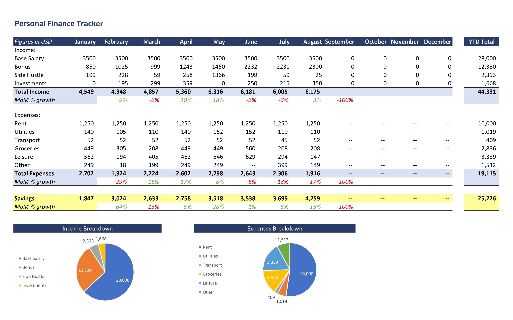
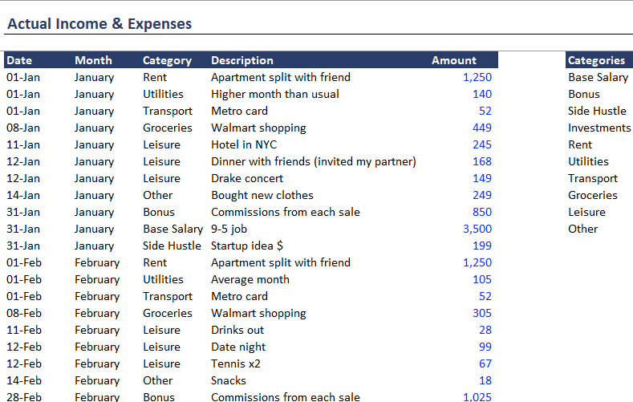

# Introduction
This is my first MS Excel Project, where I have tried to make an excel file to track personal income & expendeture. In this I have utilized conditional formatting, charts & various formulas to get the intended layout.

# Background
After I learned MS Excel, I wanted to work on a project to apply my Excel knowledge to work, solve & adapt as per the requirements.

### The aim of the project:-
1. Make a spreadsheet to record all the income & expenses.
2. Have two different tables, one for all the income sources & one for all the expenses for all months of the year.
3. I wanted the income & expense table to automatically assort the spreadsheet rows which had all the incomes & expenses combined.

# The Result

*This is the dashboard which we get. Every thing is sorted automatically.*

*In the input sheet we can input all the incomes & expenses with its date. The category for every transaction must be defined carefully as it serves the basis for the assortment in the dashboard sheet.*

